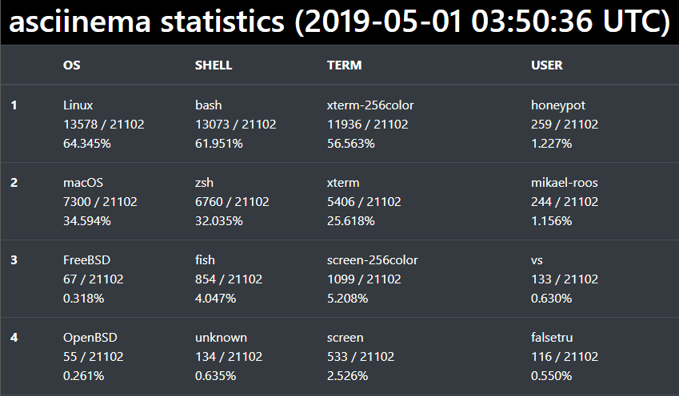

# asciinema_statistics

A statistics page of [asciinema.org](https://asciinema.org/explore/public), visit [here](https://goreliu.github.io/asciinema_statistics/).

A screenshot:



## Tools

```
bin/update: pull new data from asciinema.org/explore/public and update index.html

bin/generate: generate index.html

bin/autoupdate: run bin/update every 600s

bin/playrandom: play a random asciinema cast from asciinema.org/explore/public in terminal 
```
